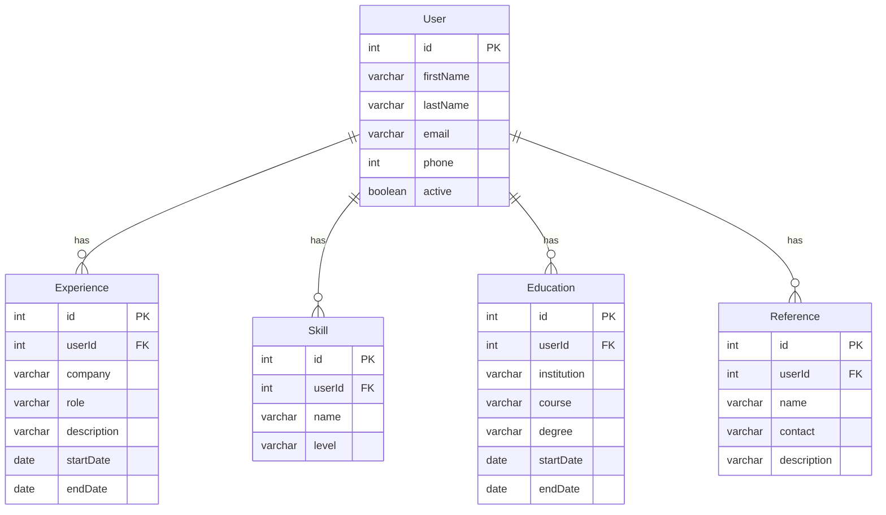

# Project Description: ProFile

### This project aims to develop a centralized platform where professionals can store and manage their professional information in an organized and detailed way. The main goal is to make it easier to fill out job application forms on different platforms, saving users time and effort.

# Benefits for Users
- Time Savings: It will no longer be necessary to repeatedly fill out the same fields on different forms.
- Accuracy of Information: Ensures that professional information is always correct and up-to-date on all platforms.
- Ease of Management: Allows you to control all information in a single place.
- Greater Visibility: Increases the chances of being noticed by recruiters on different platforms.

# Technologies Used
- Angular 18+
- Java 17
- SQL Server
- Docker

# Contributions

Contributions are always welcome! If you have suggestions, ideas or want to help in the development of this project, feel free to open an issue or send a pull request.

# Diagram

