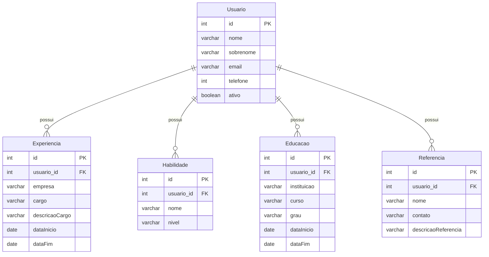

# Descrição do Projeto: ProFile

### Este projeto visa desenvolver uma plataforma centralizada onde profissionais podem armazenar e gerenciar suas informações profissionais de forma organizada e detalhada. O objetivo principal é facilitar o preenchimento de formulários de candidatura a empregos em diversas plataformas, poupando tempo e esforço aos usuários.

# Benefícios para os Usuários
- Economia de Tempo: Não será mais necessário preencher repetidamente os mesmos campos em diversos formulários.
- Precisão das Informações: Garante que as informações profissionais estejam sempre corretas e atualizadas em todas as plataformas.
- Facilidade de Gerenciamento: Permite controlar todas as informações em um único lugar.
- Maior Visibilidade: Aumenta as chances de ser notado por recrutadores em diversas plataformas.

# Tecnologias Utilizadas
- Angular 18+
- Java 17
- SQL Server
- Docker

# Contribuições

Contribuições são sempre bem-vindas! Se você tiver sugestões, ideias ou quiser ajudar no desenvolvimento deste projeto, sinta-se à vontade para abrir uma issue ou enviar um pull request.

# Diagrama

